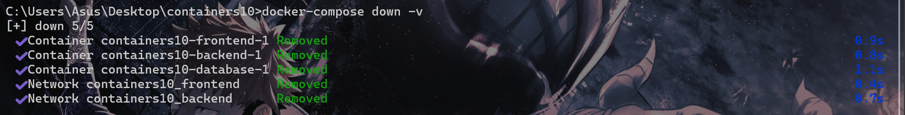
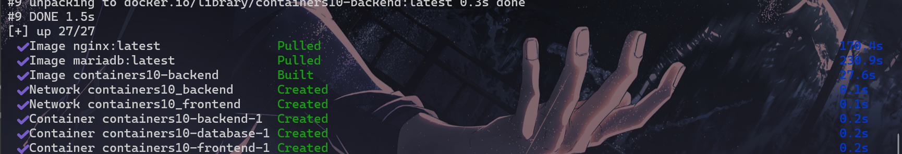
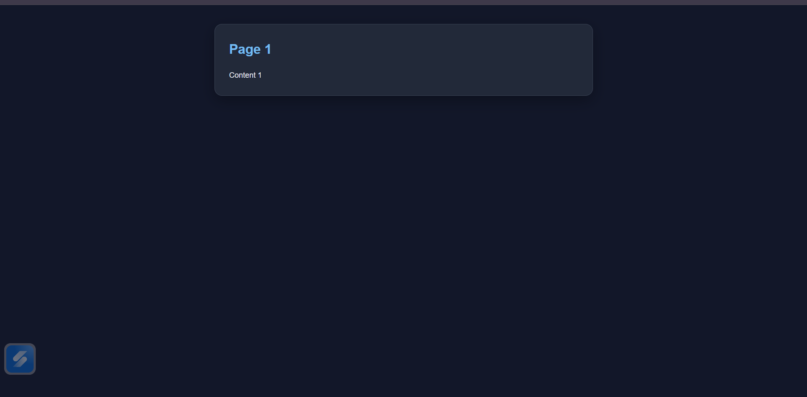
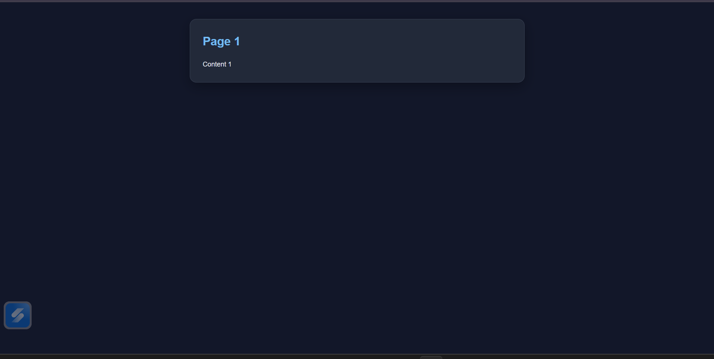
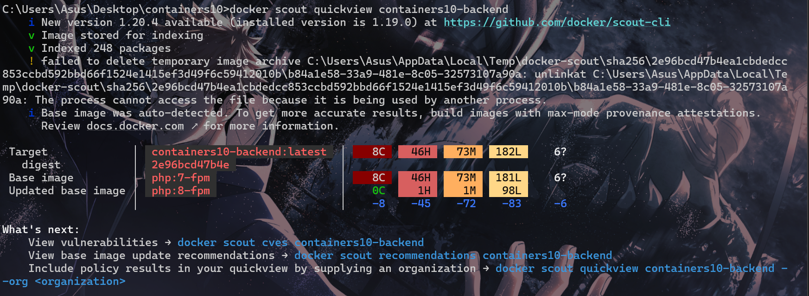
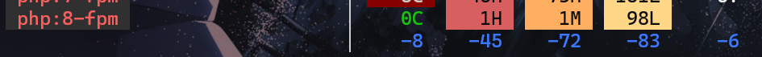
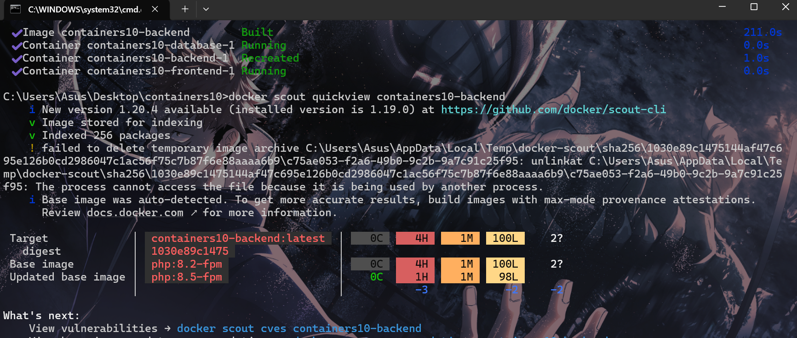

# Лабораторная работа №10 : Управление секретами в контейнерах

## Цель работы
Целью работы является знакомство с методами управления секретами в контейнерах.

## Задание
Я обязан создать многосервисное приложение с контейнерами, использующими секреты.

## Подготовка
Для выполнения данной работы необходимо иметь установленный на компьютере Docker. Работа выполняется на базе лабораторной работы `containers08`.

## Выполнение
Создал репозиторий containers10 и скопировал его себе на компьютер. В папку `containers10` скопировал содержимое проекта `containers08`.

## Настройка
Для выполнения работы используется следующий файл `docker-compose.yaml`:
```yaml
services:
  frontend:
    image: nginx:latest
    ports:
      - "80:80"
    volumes:
      - ./site:/var/www/html
      - ./nginx.conf:/etc/nginx/conf.d/default.conf
    networks:
      - frontend
  backend:
    build:
      context: .
      dockerfile: Dockerfile
    environment:
      MYSQL_HOST: database
      MYSQL_DATABASE: my_database
      MYSQL_USER: user
      MYSQL_PASSWORD_FILE: userpassword
    networks:
      - backend
      - frontend
  database:
    image: mariadb:latest
    environment:
      MYSQL_ROOT_PASSWORD: rootpassword
      MYSQL_DATABASE: my_database
      MYSQL_USER: user
      MYSQL_PASSWORD: userpassword
    networks:
      - backend
      - frontend

networks:
  frontend: {}
  backend: {}
```

`build`: собрать образ из Dockerfile, а не скачивать готовый

`environment` : переменные окружения, которые передаются внутрь контейнера

поднимаем 3 сервиса и соединяем их в одну систему:

**1. frontend (nginx)**
- Образ `nginx:latest`
- Открывает сайт на порту `80`
- Подключает: `./site`
- `nginx.conf` → как конфиг nginx
Работает в сети frontend


2. **backend**
- Собирается из  Dockerfile
- Получает переменные для подключения к БД:
  - хост: database
  - база: my_database
  - пользователь и пароль

- Подключён к сетям:
  - backend
  - frontend

 3. **database (MariaDB)**
- Образ `mariadb:latest`
- Создаёт: базу `my_database`, пользователя user и работает в сетях `backend` и `frontend`

Изменяю класс обертку над базой данных таким образом, чтобы конструктор имел прототип:

`public function __construct(string $dsn, string $username, string $password);`

**DSN (Data Source Name)** — это строка, в которой описано, как подключиться к базе данных.

```php
    public function __construct(string $dsn, string $username = '', string $password = '') {
        $this->pdo = new PDO($dsn, $username, $password);
        $this->pdo->setAttribute(PDO::ATTR_ERRMODE, PDO::ERRMODE_EXCEPTION);
    }
```

Обновил файл `index.php` таким образом, чтобы он использовал новый конструктор:
```php
<?php

require_once __DIR__ . '/modules/database.php';
require_once __DIR__ . '/modules/page.php';
require_once __DIR__ . '/config.php';

$dsn = "mysql:host={$config['db']['host']};dbname={$config['db']['database']};charset=utf8";

$db = new Database(
    $dsn,
    $config['db']['username'],
    $config['db']['password']
);

$page = new Page(__DIR__ . '/templates/index.tpl');

// Безопасно получаем id
$pageId = isset($_GET['page']) ? (int)$_GET['page'] : 1;

// Получаем данные
$data = $db->Read("page", $pageId);

// Если страницы нет
if (!$data) {
    $data = [
        'title' => 'Ошибка',
        'content' => 'Страница не найдена'
    ];
}

$page->Render($data);
```

`host` — где база
`dbname` — имя базы
`charset` — кодировка

вызывается `__construct`
внутри создаётся PDO
теперь $db умеет делать запросы

```php
$page = new Page(__DIR__ . '/templates/index.tpl');
```
Создаётся объект, который:

берёт `HTML-шаблон`
потом вставит в него данные

Обновил `Dockerfile`, заменив установку расширения `pdo_sqlite` на установку расширения `pdo_mysql`.


```docker
FROM php:7.4-fpm AS base

# install pdo_mysql extension
RUN apt-get update && \
    apt-get install -y libzip-dev && \
    docker-php-ext-install pdo_mysql

# copy site files
COPY site /var/www/html
```

- Docker берёт образ с `PHP`
- Устанавливает нужные пакеты:
  - libzip-dev — библиотека для работы с ZIP-архивами
  - pdo_mysql — расширение PHP для подключения к MySQL через PDO
- Добавляет поддержку MySQL
- Копирует твой сайт внутрь

Конфигурационный файл для `nginx` взял из лабораторной работы `containers07`. Согласно этой инструкции:
```yml
      - ./nginx.conf:/etc/nginx/conf.d/default.conf
```

```js
server {
    listen 80;
    server_name _;
    root /var/www/html;
    index index.php;
    location / {
        try_files $uri $uri/ /index.php?$args;
    }
    location ~ \.php$ {
        fastcgi_pass backend:9000;
        fastcgi_index index.php;
        fastcgi_param SCRIPT_FILENAME $document_root$fastcgi_script_name;
        include fastcgi_params;
    }
}
```

Обновляем наш config.php:
```php
<?php

$config = [
    "db" => [
        "host" => getenv('MYSQL_HOST'),
        "database" => getenv('MYSQL_DATABASE'),
        "username" => getenv('MYSQL_USER'),
        "password" => getenv('MYSQL_PASSWORD'),
    ]
];
```

В схеме изменяем `INTEGER PRIMARY KEY AUTOINCREMENT` ->
`INT AUTO_INCREMENT PRIMARY KEY`:
```sql
CREATE TABLE page (
    id INT AUTO_INCREMENT PRIMARY KEY,
    title TEXT,
    content TEXT
);

INSERT INTO page (title, content) VALUES ('Page 1', 'Content 1');
INSERT INTO page (title, content) VALUES ('Page 2', 'Content 2');
INSERT INTO page (title, content) VALUES ('Page 3', 'Content 3');

```
Подключаем схему:
```yaml
  volumes:
    - ./sql/schema.sql:/docker-entrypoint-initdb.d/schema.sql
```
Старую базу данных можно удалить командой:
```bash
docker-compose down -v
```


Проверил работоспособность приложения.

```bash
docker-compose up --build -d
```




все равно ничего не выводится, заменяем return на echo и полуаем страницу:
```php
public function Render($data) {
    extract($data);

    ob_start();
    include $this->template;
    echo ob_get_clean();
    }
}
```



# Защита секретов

Docker Secrets - это безопасное хранение паролей и ключей через файлы которые Docker скрывает, а не переменные

Создал папку `secrets` и добавил в нее файлы:

- `root_secret` - пароль суперпользователя;
- `user` - имя пользователя базы данных;
- `secret` - пароль пользователя базы данных.

Прописал содержимое данных файлов.

Обновил `файл docker-compose.yaml` таким образом, чтобы он использовал созданные секреты. Для этого добавил секцию `secrets`:
```yml
secrets:
  root_secret:
    file: ./secrets/root_secret
  user:
    file: ./secrets/user
  secret:
    file: ./secrets/secret
```
Для сервиса `database` обновил секцию environment:

```yml
environment:
  MYSQL_ROOT_PASSWORD_FILE: /run/secrets/root_secret
  MYSQL_DATABASE: my_database
  MYSQL_USER_FILE: /run/secrets/user
  MYSQL_PASSWORD_FILE: /run/secrets/secret
```

Также обновил сервис `backend`:
```yml
environment:
  MYSQL_HOST: database
  MYSQL_DATABASE: my_database
```

Добавил в содержимое конфигурационного файла `config.php` следующие строки:

```php
$config['db']['host'] = getenv('MYSQL_HOST');
$config['db']['database'] = getenv('MYSQL_DATABASE');
// $config['db']['username'] = getenv('MYSQL_USER');
// $config['db']['password'] = getenv('MYSQL_PASSWORD');
$config['db']['username'] = get_file_contents('/run/secrets/user');
$config['db']['password'] = get_file_contents('/run/secrets/secret');
```

МОЯ КОНФИГУРАЦИЯ:
```php
<?php

function getSecret($path) {
    return trim(file_get_contents($path));
}

$config = [
    "db" => [
        "host" => getenv('MYSQL_HOST'),
        "database" => getenv('MYSQL_DATABASE'),
        "username" => getSecret('/run/secrets/user'),
        "password" => getSecret('/run/secrets/secret'),
    ]
];

```
Если сайт не отображается, обновляем страницу, база данных MariaDB не создалась еще.

после изменений сайт по-прежнему работает


## Запуск и тестирование
Проверил образ сервиса `containers10-backend` на их безопасность с помощью **docker scout**:

```yaml
docker scout quickview containers10-backend
```

`Docker Scout` - это инструмент от Docker для проверки безопасности образов.



Он анализирует  Docker-образ и показывает уязвимости (CVE), устаревшие пакеты, насколько образ безопасен.

`8C`  `46H`  `73M`  `182L`

- `C` --	Critical (критические)
- `H` --	High (высокие)
- `M` --	Medium
- `L` --	Low

-  8 критических
-  46 высоких
-  73 средних
-  182 низких


Но если обновить до php:8-fpm многие уязвимости исчезнут

`FROM php:8.2-fpm AS BASE`





обновление до 8.5 ЕЩЕ СИЛЬНЕЕ снизит количество уязвимостей.


`CVE` - уникальный ID уязвимости

**нужен** чтобы находить дыры в безопасности, понимать, безопасен ли образ, обновлять зависимости вовремя.

# Ответы на вопросы:

1. Почему плохо передавать секреты в образ при сборке?
- попадают в слои Docker (их можно вытащить)
- остаются в истории образа
- могут утечь через **registry / git**

`итог: небезопасно`

2. Как можно безопасно управлять секретами в контейнерах?
Для этого необходимо:
- использовать переменные окружения (лучше просто вшить, но не идеально), 

потому, что
они не попадают в образ, не хранятся в слоях Docker, не лежат в Dockerfile ,легко менять, можно задать при запуске контейнера,не коммитятся в код если правильно настроить. `(через .env, CI/CD)`


- использовать Docker Secrets
-хранить вне кода (не в репозитории)


3. Как использовать `Docker Secrets` для управления конфиденциальной информацией?

Нужно Создать файлы с секретами

 указать их в docker-compose.yml:
```yml
secrets:
  user:
    file: ./secrets/user
  password:
    file: ./secrets/password
```
Подключить к сервису  и после этого уже можно использовать в контейнере
```
services:
  app:
    image: myapp
    secrets:
      - user
      - password
```

Секреты появляются как файлы:

```bash
/run/secrets/user
/run/secrets/password
```
Например, можно получить данные в коде:
```php
$username = file_get_contents('/run/secrets/user');
$password = file_get_contents('/run/secrets/password');
```